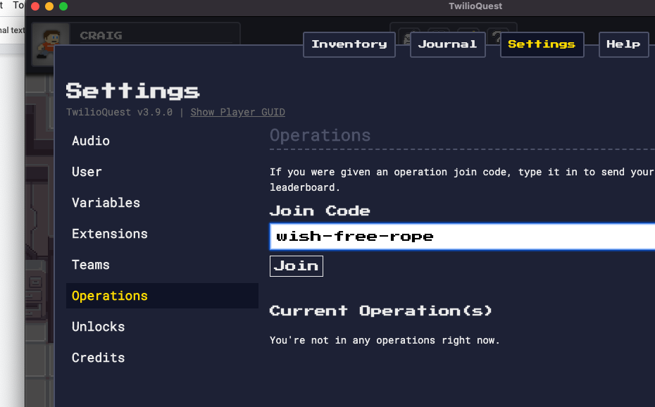

# Welcome to On Demand Superclass

On Demand Superclass is a guided experience that helps you choose your own learning adventure through the ever expanding Twilioverse.

On this README you will find [workshops](#workshops), suggested [hands-on learning resources](#hands-on-learning-resources), [TwilioQuest](#twilioquest) our educational video game, and moar!

We believe the best time to ask questions is when you have one, so please make sure to [ask questions](https://twil.io/ask-questions)

## Welcome to Superclass

- 👀 [Cedric's Joke Hotline GitHub repository](https://github.com/TwilioDevEd/cedrics-joke-hotline-superclass-studio)

Ahoy, Builder! In this welcome session we'll talk about "what even is a Twilio", meet Cedric, and discuss how to get the most out of your Superclass adventure. 

Make sure to get inspired by your [fellow builders](https://customers.twilio.com/).

## Workshops

We hope your adventures leave you **inspired to build** ,knowing how to get started developing, as well as, how to continue learning and scaling on the Twilio platform!

### Twilio SendGrid 101: An Introduction to Sending Transactional Email

- 👀 [Twilio SendGrid 101 GitHub Repository](https://github.com/TwilioDevEd/twilio_sendgrid_101)

Among the communication channels available today, email is non-negotiable. Email is reliable, works globally, and offers flexibility that can't be met by other communications avenues. In this workshop, you'll learn how to implement the Twilio SendGrid Mail Send API to programmatically deliver email at scale. You'll also see how the Twilio SendGrid dynamic templating system makes it possible to personalize your messages for each customer, and you can expect some deliverability pro-tips along the way.

**Wade Christensen**
Staff, Developer Educator

### Introduction to Messaging

- 👀 [Introduction to Messaging Repository](https://github.com/TwilioDevEd/introduction-to-messaging-superclass-workshop)

We'll explore sending messages using the Twilio APIs using a plethora of tools: Helper Libraries, the CLI , Twilio Functions, and our No Code/Low Code solution Studio.

**Craig Dennis** Staff, Developer Educator 

### Introduction to Segment: The Customer Data Platform

- 📚[Segment Recipes - Step-by-step Tutorials](https://segment.com/recipes/)
- 🙋‍♂️ [Segment Twilio Developer Plan](https://segment.com/twilio-developer-plan/)

Segment 101: If you've never heard of a Customer Data Platform before, this session is for you! We'll cover the basics of why you need a CDP and what Segment does better than all the rest!

**Ben Link**
Developer Advocate 

### Email Deliverability

- 👀 [Email Deliverability GitHub Repository](https://github.com/TwilioDevEd/email-deliverability-workshop)

Learn how to leverage Twilio SendGrid Webhooks and APIs to improve email deliverability and customer engagement. We will delve into our Twilio SendGrid Email Validation API, Contacts & Lists API and Event Webhook.

**Elmer Thomas**
Staff, Developer Educator 

### Scaling Messaging

- 📚 [REST API Best Practices](https://www.twilio.com/docs/usage/rest-api-best-practices)
- 📚 [Best Practices for Scaling with Messaging Services](https://www.twilio.com/docs/messaging/guides/best-practices-at-scale)
- 📚 [A2P10DLC - Application 2 Person 10 Digit Long Code - Guide](https://www.twilio.com/a2p-10dlc)
- 🧮 [Message Segment Calculator](https://twiliodeved.github.io/message-segment-calculator/)

The Message API will get you very far, but when it comes to scale, it's helpful to take a step back and think through some best practices. In this talk we'll walk through things you should consider, and provide guidance for how you can take your applications to the next level. 

**Craig Dennis**
Staff, Developer Educator

### Scaling with Segment

- 👨‍🎓 [Segment University](https://university.segment.com)

You may ask yourself – what does a CDP have to do with developers? It’s pretty simple – you get to spend less time managing ETLs, and more time focusing on core products and customer experiences. Join us for a Superclass to explore how Segment can help support your engineering organization as it scales - ultimately lowering costs with first-party data your teams can trust.

**Bryn Saunders**
Senior Product Marketing Manager

## TwilioQuest

🚀 Lead your intrepid crew on a mission to save The Cloud in TwilioQuest, a PC role-playing game inspired by classics of the 16-bit era. Enhance your programming skills and learn to build with Twilio’s Messaging and Voice APIs in the Twilio VR Training mission. 

🎮 Download [TwilioQuest](https://twilio.com/quest) today on Windows, Mac, or Linux to get started. 

📈 Join the Superclass Operation to track your progress on a global leaderboard, using the special code `wish-free-rope`.

## Recombee

[Bryn](#scaling-with-segment) introduced you to Recombee in his "Scaling with Segment" presentation.  If you'd like to get better acquainted with Recombee, check out these resources:
- 🍿 [Level Up with Segment Destinations: Recommendation Engine Recombee](https://interactive.twilio.com/level-up-with-segment-destinations-recommendation-engine-recombee)
- Explore [Recombee](https://www.recombee.com/signal-superclass.html)
- Superclass attendees have access to a [completely free consultation](https://www.recombee.com/signal-journey.html)!
- Contact [Recombee Support](mailto://support.recombee.com)

## Hands On Learning Resources

If you’ve used Twilio in the past, chances are you’ve only used one or two different products. One of the best ways to get exposed to new Twilio capabilities is to deploy and test out a sample application on the [Twilio CodeExchange](https://twilio.com/code-exchange). Choose a sample application from this repository, and get it running on your own Twilio account.

Here are some options for apps, tutorials, and video lessons to check out, broken down by product:

### Twilio Messaging

- 💻 [CodeExchange - SMS and WhatsApp](https://www.twilio.com/code-exchange?q=&f=sms&f=whatsapp)   
- 📚 [SMS Tutorials - Twilio docs](https://www.twilio.com/docs/tutorials?filter-product=SMS) 
- 📚 [Messaging Guide: Best Practices at Scale](https://www.twilio.com/docs/messaging/guides/best-practices-at-scale)
    
### Twilio Voice

- 💻 [CodeExchange - Voice](https://www.twilio.com/code-exchange?q=&f=voice)
- 📚 [Voice Tutorials - Twilio docs](https://www.twilio.com/docs/tutorials?filter-product=Voice)

### Twilio Verify

- 💻 [CodeExchange - Broadcast SMS with Verified Sign Up](https://www.twilio.com/code-exchange/verified-broadcast-sms)
- ✍️ [Build an SMS notification service with a verified sign up page](https://www.twilio.com/blog/verified-sms-broadcast-service-low-code)
- 💻 [CodeExchange - more Verify API examples](https://www.twilio.com/code-exchange?q=&f=verify)

### Twilio Flex

- 💻 [CodeExchange - Flex](https://www.twilio.com/code-exchange?q=&f=flex)
- 📚 [Twilio Flex - Docs](https://www.twilio.com/docs/flex)
- 💪 [Flexercises](https://twilio.learnupon.com/store)

### Twilio Serverless

- 👀 [Twilio Serverless](https://www.twilio.com/serverless)
- 📚 [TwiML Bins tutorial - Docs](https://www.twilio.com/docs/runtime/tutorials/twiml-bins)
- 📚 [Twilio Functions and Assests - Docs](https://www.twilio.com/docs/serverless/functions-assets)
-   📚 [Understanding Function & Asset Visibility - Docs](https://www.twilio.com/docs/runtime/functions-assets-api/api/understanding-visibility-public-private-and-protected-functions-and-assets)
- 📚 [Twilio Studio - Twilio docs](https://www.twilio.com/docs/studio)
  
### Twilio Video

- 📚 [Programmable Video Tutorial - Twilio docs](https://www.twilio.com/docs/video/overview#resources-for-getting-started) 
- 💻 [CodeExchange - Programmable Video](https://www.twilio.com/code-exchange?q=&f=video)

## Moar On Demand Learning Resources
- 🍿 [Twilio Essentials: Messaging, Voice & Serverless Tutorial - LinkedIn Learning](https://www.linkedin.com/learning/instructors/twilio)
- 🍿 [Twilio Essentials: Messaging, Voice & Serverless Tutorial - YouTube](https://youtu.be/4jUMqutYmyE)
- 🍿 [Level Up with Video: Add live video to your applications](https://ahoy.twilio.com/devgen_webinar_programmable_video_uplevel_NAMER-1)
- 🍿 [Level Up with Twilio Programmable Voice: Build interactive phone based apps](https://ahoy.twilio.com/devgen_webinar_programmable_voice_uplevel_NAMER-1)
- 🍿 [Level Up with Voice: Add a phone to your browser using the Voice SDK](https://ahoy.twilio.com/devgen_webinar_programmable_voice_uplevel_NAMER_2-1)
- 👀 [All Level Up Developer Webinars](https://twil.io/levelups)